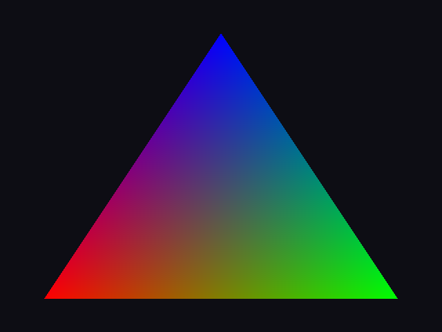
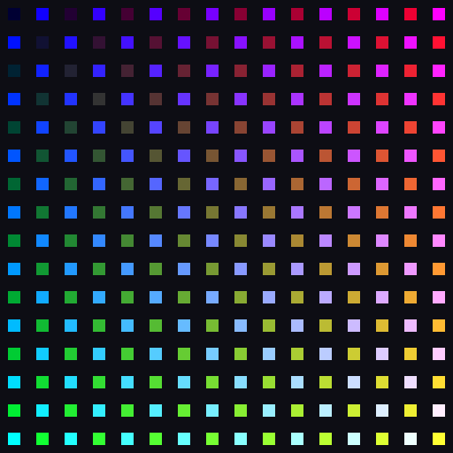
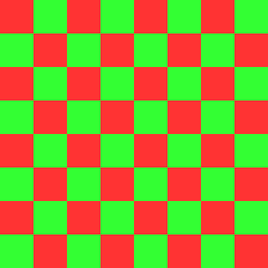
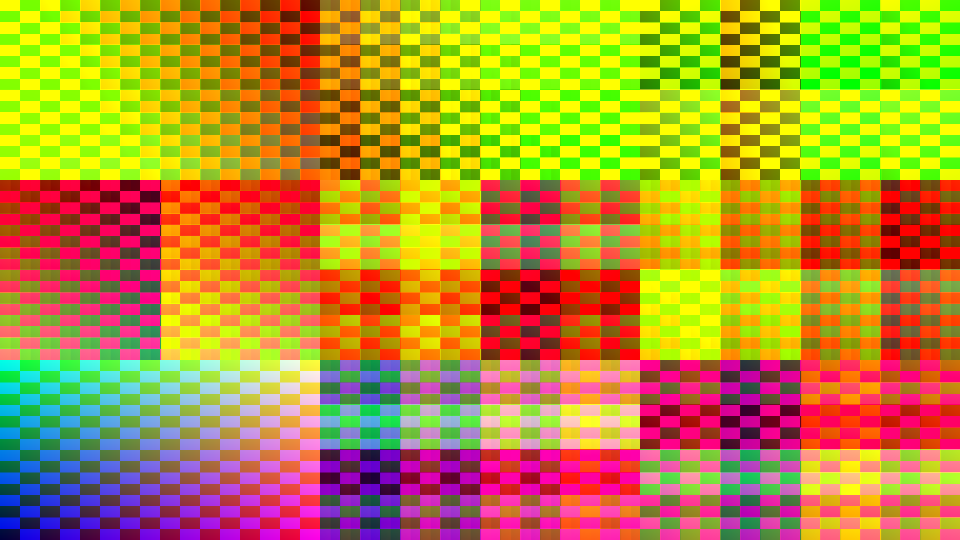
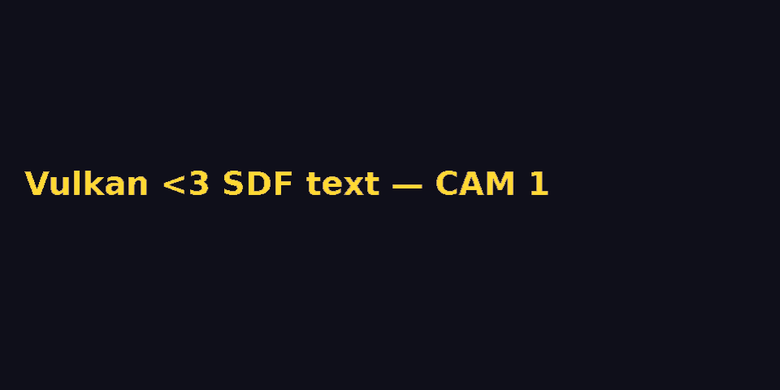

# VulkanExamples

Minimal, self-contained **C++23 / Vulkan-Hpp** examples — one concept
per directory, each with a semi-automated `check.py` that verifies the
rendered output (pixel-exact where possible). Every example is the
companion code to a full tutorial post on
[TechOverflow](https://techoverflow.net) (linked below).

All code is [CC0](LICENSE) — public domain, use it however you like.

## Layout

- `vkmini.hpp` — shared ~300-line helper (instance/device/surface,
  shaderc GLSL→SPIR-V, buffer/image creation, one-time command
  buffers, swapchain + readback, dynamic dispatch). Each example dir
  symlinks it, so every `main.cpp` is readable standalone.
- `pNN-*/main.cpp` — the example. Single file, comments reference the
  spec sections.
- `pNN-*/check.py` — runs or verifies the example; used as the CI-less
  test suite.
- `tools/build-all.sh` — builds every example (`g++ -std=c++23 -O2`).
- `tools/make-screenshots.sh` — runs all examples under Xvfb and
  regenerates `screenshots/`.
- `screenshots/` — autogenerated outputs (headless render → PNG, or
  Xvfb window capture).

## Dependencies (Debian/Ubuntu)

```bash
sudo apt install libvulkan-dev libglfw3-dev libshaderc-dev \
    libpng-dev python3 imagemagick xvfb
```

## Build & test one example

```bash
bash tools/build-all.sh          # build everything
cd p02-triangle
./app --headless out.ppm         # render offscreen
python3 check.py                 # verify pixels
```

Windowed examples (`p12`, `p19`, `p20`, `p36`, `p46`) run under
`xvfb-run`; the check scripts handle that themselves.

> **Note on `p40_video`:** the Vulkan Video decode-submit path can
> crash some drivers hard enough to take the session down (observed
> on RADV). The example deliberately *queries* capabilities and
> cleanly SKIPs on devices without a decode queue. Test it with
> `VK_ICD_FILENAMES=/usr/share/vulkan/icd.d/intel_icd.json` if you
> want to stay off the dGPU. `make-screenshots.sh` never runs it.

---

## The examples

### Fundamentals (window, triangle, buffers)

| # | Example | What it demonstrates | Post |
|---|---------|----------------------|------|
| 01 | `p01-surface` | Vulkan instance + GLFW window + `VkSurfaceKHR` + clearing to a solid color — the minimal "is Vulkan working" program | [How to create a Vulkan surface using GLFW](https://techoverflow.net/2026/09/25/how-to-create-a-vulkan-surface-using-glfw/) |
| 02 | `p02-triangle` | First triangle with `VK_KHR_dynamic_rendering` — no render pass object, no vertex buffers, `gl_VertexIndex` fullscreen-less triangle, headless PPM output | [How to draw your first triangle in Vulkan with dynamic rendering](https://techoverflow.net/2026/09/25/how-to-draw-your-first-triangle-in-vulkan-with-dynamic-rendering/) |
| 03 | `p03-vbuf` | Vertex buffer + staging upload: host-visible staging buffer → `vkCmdCopyBuffer` → device-local vertex buffer → `vkCmdBindVertexBuffers` | [How to use vertex buffers in Vulkan (staging upload + vertex input)](https://techoverflow.net/2026/09/26/how-to-use-vertex-buffers-in-vulkan-staging-upload-vertex-input/) |
| 04 | `p04-push` | Push constants — per-draw data (offset + color) without descriptors; includes the std430 `vec3` alignment trap | [Vulkan push constants explained: per-draw shader data](https://techoverflow.net/2026/09/26/vulkan-push-constants-explained-per-draw-shader-data/) |
| 05 | `p05-texture` | Texture upload + sampling: staging → `VkImage`, layout transitions, `sampler2D` + descriptor set | [How to upload and sample a texture in Vulkan](https://techoverflow.net/2026/09/26/how-to-upload-and-sample-a-texture-in-vulkan/) |
| 06 | `p06-compute` | Compute shader writing into an SSBO + host readback — GPU-side data generation | [Vulkan compute shaders: GPU-side data generation and readback via storage buffers](https://techoverflow.net/2026/09/26/vulkan-compute-shaders-gpu-side-data-generation-and-readback-via-storage-buffers/) |
| 07 | `p07-img` | Compute shader writing a `storageImage` (rgba8), then sampling it in a graphics pass — compute→sample chaining | [How to write a storage image in a Vulkan compute shader and sample it](https://techoverflow.net/2026/09/26/how-to-write-a-storage-image-in-a-vulkan-compute-shader-and-sample-it/) |
| 08 | `p08-fif` | Frames in flight: N command buffers, per-frame fence+semaphore pairs, acquire/present overlap | [Vulkan frames in flight: proper fence and semaphore synchronization](https://techoverflow.net/2026/09/26/vulkan-frames-in-flight-proper-fence-and-semaphore-synchronization/) |
| 09 | `p09-ibuf` | `vkCmdDrawIndexed` + `VK_INDEX_TYPE_UINT16` — 4 verts / 6 indices quad | [How to use index buffers in Vulkan (vkCmdDrawIndexed)](https://techoverflow.net/2026/09/27/how-to-use-index-buffers-in-vulkan-to-draw-indexed-geometry-with-vkcmddrawindexed/) |
| 10 | `p10-ubo` | UBO + MVP matrix — a tilting quad verified by scanline widths | [How to use uniform buffers in Vulkan for MVP matrix transformations](https://techoverflow.net/2026/09/27/how-to-use-uniform-buffers-in-vulkan-for-mvp-matrix-transformations/) |

### Swapchain & rasterization

| # | Example | What it demonstrates | Post |
|---|---------|----------------------|------|
| 11 | `p11-depth` | Depth attachment (D32), `depthWriteEnable`, near quad wins over far quad regardless of draw order | [How to add a depth attachment in Vulkan for correct 3D occlusion](https://techoverflow.net/2026/09/27/how-to-add-a-depth-attachment-in-vulkan-for-correct-3d-occlusion/) |
| 12 | `p12-resize` | Swapchain recreation on resize: `OUT_OF_DATE`/`SUBOPTIMAL` + framebuffer-size polling under Xvfb | [How to handle swapchain recreation on window resize in Vulkan](https://techoverflow.net/2026/09/27/how-to-handle-swapchain-recreation-on-window-resize-in-vulkan/) |
| 13 | `p13-inst` | `vkCmdDraw(instanced)` — 256 quads in one draw, per-instance data via instance-rate vertex attributes | [How to use instanced rendering in Vulkan with per-instance vertex attributes](https://techoverflow.net/2026/09/27/how-to-use-instanced-rendering-in-vulkan-with-per-instance-vertex-attributes/) |
| 14 | `p14-msaa` | `eSampleCount4` + `resolveImageView` — checker counts AA blend pixels at the triangle edge | [How to enable MSAA multisampling in Vulkan with dynamic rendering](https://techoverflow.net/2026/09/27/how-to-enable-msaa-multisampling-in-vulkan-with-dynamic-rendering/) |
| 15 | `p15-mips` | Mipmap chain via `vkCmdBlitImage` — `textureLod(8)` proves the full downsample chain | [How to generate mipmaps in Vulkan using vkCmdBlitImage](https://techoverflow.net/2026/09/27/how-to-generate-mipmaps-in-vulkan-using-vkcmdblitimage/) |
| 16 | `p16-postfx` | Two-pass post-processing: scene → offscreen → fullscreen-triangle invert pass, one command buffer | [How to build a multi-pass post-processing pipeline in Vulkan](https://techoverflow.net/2026/09/27/how-to-build-a-multi-pass-post-processing-pipeline-in-vulkan-offscreen-pass-to-screen/) |
| 17 | `p17-timeline` | `VkSemaphoreType::eTimeline` — one semaphore counting 0→4 across submits, `vkSignalSemaphore`/`vkWaitSemaphores` | [How to use timeline semaphores in Vulkan for value-based GPU synchronization](https://techoverflow.net/2026/09/27/how-to-use-timeline-semaphores-in-vulkan-for-value-based-gpu-synchronization/) |
| 18 | `p18-validation` | `VK_LAYER_KHRONOS_validation` + debug utils labels — intentionally triggers an error to show the message format | [How to enable Vulkan validation layers and use debug labels](https://techoverflow.net/2026/09/27/how-to-enable-vulkan-validation-layers-and-use-debug-labels-for-troubleshooting/) |

### Screenshots & shader plumbing

| # | Example | What it demonstrates | Post |
|---|---------|----------------------|------|
| 19 | `p19-screenshot` | Swapchain readback: `eTransferSrc` usage gate, layout transitions around `vkCmdCopyImageToBuffer`, 10-bit format unpacking | [How to take a screenshot of a Vulkan window programmatically](https://techoverflow.net/2026/09/27/how-to-take-a-screenshot-of-a-vulkan-window-programmatically-swapchain-readback/) |
| 20 | `p20-pngshot` | Same readback → libpng PNG encode; check.py contains a pure-Python PNG decoder as end-to-end verifier | [How to encode a Vulkan framebuffer readback as PNG with libpng](https://techoverflow.net/2026/09/27/how-to-encode-a-vulkan-framebuffer-readback-as-png-with-libpng/) |
| 21 | `p21-specconst` | `VkSpecializationInfo` — one SPIR-V → two pipeline variants (checkerboard density differs per constant) | [How to use specialization constants in Vulkan to bake shader variants](https://techoverflow.net/2026/09/27/how-to-use-specialization-constants-in-vulkan-to-bake-shader-variants-into-pipelines/) |
| 22 | `p22-pipelinecache` | `vkCreatePipelineCache` + `vkGetPipelineCacheData` — cold run writes a blob, warm run reloads it | [How to persist compiled Vulkan pipelines with VkPipelineCache](https://techoverflow.net/2026/09/27/how-to-persist-compiled-vulkan-pipelines-with-vkpipelinecache/) |
| 23 | `p23-secondary` | Secondary command buffers + `eRenderPassContinue` inheritance — three buffers, three colored quads | [How to use secondary command buffers in Vulkan to record drawing in parallel](https://techoverflow.net/2026/09/27/how-to-use-secondary-command-buffers-in-vulkan-to-record-drawing-in-parallel/) |
| 24 | `p24-indirect` | `vkCmdDrawIndirect` — draw parameters live in a device buffer, one call renders a 2×2 grid | [How to use vkCmdDrawIndirect in Vulkan for GPU-driven drawing](https://techoverflow.net/2026/09/27/how-to-use-vkcmddrawindirect-in-vulkan-for-gpu-driven-drawing/) |
| 25 | `p25-vertexpull` | Vertex pulling — empty vertex-input state, `gl_VertexIndex` indexes an SSBO; no vertex buffer at all | [How to do vertex pulling in Vulkan using an SSBO instead of vertex buffers](https://techoverflow.net/2026/09/27/how-to-do-vertex-pulling-in-vulkan-using-an-ssbo-instead-of-vertex-buffers/) |
| 26 | `p26-descindex` | `sampler2D tex[4]` array + dynamic-uniform index — four draws, four textures, one binding | [How to index into a texture array in Vulkan with arrayed sampler bindings](https://techoverflow.net/2026/09/27/how-to-index-into-a-texture-array-in-vulkan-with-arrayed-sampler-bindings/) |

### Production techniques

| # | Example | What it demonstrates | Post |
|---|---------|----------------------|------|
| 27 | `p27-sync2` | `vkCmdPipelineBarrier2` with precise stage/access masks — compute writes → graphics samples, one cmd buffer | [How to use Vulkan synchronization2 barriers (vkCmdPipelineBarrier2)](https://techoverflow.net/2026/09/27/how-to-use-vulkan-synchronization2-barriers-vkcmdpipelinebarrier2/) |
| 28 | `p28-caps` | `vkGetPhysicalDeviceProperties2` chain — limits, features, `pipelineCacheUUID` | [How to query Vulkan device capabilities: properties, limits and features](https://techoverflow.net/2026/09/28/how-to-query-vulkan-device-capabilities-properties-limits-and-features/) |
| 29 | `p29-threads` | Multi-threaded recording: 4 std::threads × private command pools → 4 secondaries → R/G/B/W stripes | [How to record Vulkan command buffers from multiple threads](https://techoverflow.net/2026/09/28/how-to-record-vulkan-command-buffers-from-multiple-threads-with-per-thread-pools/) |
| 30 | `p30-timestamp` | `vkCmdWriteTimestamp` + `timestampPeriod` — real GPU-side µs, not CPU chrono | [How to measure GPU frame time in Vulkan with timestamp queries](https://techoverflow.net/2026/09/28/how-to-measure-gpu-frame-time-in-vulkan-with-timestamp-queries/) |
| 31 | `p31-stagingring` | Persistent staging ring: 2 fenced slots, 5 uploads, wraparound waits logged | [How to stream uploads through a persistent staging ring in Vulkan](https://techoverflow.net/2026/09/28/how-to-stream-uploads-through-a-persistent-staging-ring-in-vulkan/) |
| 32 | `p32-bda` | `VK_KHR_buffer_device_address` — `uint64` pointer in a push constant, zero descriptor sets | [How to use VK_KHR_buffer_device_address in Vulkan for pointer-based shader access](https://techoverflow.net/2026/09/28/how-to-use-vk-khr-buffer-device-address-in-vulkan-for-pointer-based-shader-access/) |
| 33 | `p33-blur` | Compute post-filter: 5×5 box blur on a storage image, `eGeneral` layout | [How to write a compute post-processing filter in Vulkan](https://techoverflow.net/2026/09/28/how-to-write-a-compute-post-processing-filter-in-vulkan/) |
| 34 | `p34-readback` | Non-stalling readback: 3-slot fenced ring, 6 frames, zero `waitIdle` | [How to do non-stalling GPU readback in Vulkan with a fenced ring](https://techoverflow.net/2026/09/28/how-to-do-non-stalling-gpu-readback-in-vulkan-with-a-fenced-ring/) |
| 35 | `p35-localread` | `VK_KHR_dynamic_rendering_local_read` + `subpassLoad` — read the framebuffer mid-rendering (TBDR-style feedback) | [How to read the framebuffer inside a render pass with dynamic_rendering_local_read](https://techoverflow.net/2026/09/28/how-to-read-the-framebuffer-inside-a-render-pass-in-vulkan-with-dynamic-rendering-local-read/) |
| 36 | `p36-skeleton` | Full app skeleton: init → frame loop → resize → clean shutdown, 90 frames under Xvfb | [How to structure a minimal Vulkan renderer: init, frame, resize, shutdown](https://techoverflow.net/2026/09/28/how-to-structure-a-minimal-vulkan-renderer-init-frame-resize-shutdown/) |

### Advanced / hardware features

| # | Example | What it demonstrates | Post |
|---|---------|----------------------|------|
| 37 | `p37_bindless` | `VK_EXT_descriptor_indexing` — one runtime descriptor array, `nonuniformEXT` per-fragment indexing | [How to use bindless texture arrays in Vulkan](https://techoverflow.net/2026/09/27/how-to-use-bindless-texture-arrays-in-vulkan-with-vk-ext-descriptor-indexing/) |
| 38 | `p38_ycbcr` | `VK_KHR_sampler_ycbcr_conversion` — NV12 planes → RGB inside an immutable sampler | [How to sample YUV video frames directly as RGB in Vulkan](https://techoverflow.net/2026/09/27/how-to-sample-yuv-video-frames-directly-as-rgb-in-vulkan-with-vk-khr-sampler-ycbcr-conversion/) |
| 39 | `p39_dmabuf` | `VK_EXT_external_memory_dma_buf` + `VK_EXT_image_drm_format_modifier` — export a VkImage's memory as dma-buf fd, re-import it zero-copy | [How to import a Linux DMA-Buf as a VkImage for zero-copy sharing](https://techoverflow.net/2026/09/27/how-to-import-a-linux-dma-buf-as-a-vkimage-for-zero-copy-sharing-in-vulkan/) |
| 40 | `p40_video` | `VK_KHR_video_decode_queue` + `VK_KHR_video_decode_h264` — SPS/PPS parsing, video session, decode queue; clean SKIP without a decode queue | [How to decode H.264 on the GPU with Vulkan Video](https://techoverflow.net/2026/09/27/how-to-decode-h-264-on-the-gpu-with-vulkan-video-vk-khr-video-decode-queue/) |
| 41 | `p41_multiqueue` | Dedicated transfer queue: async texture upload + queue-family ownership transfer synced by timeline semaphore | [How to use a dedicated transfer queue in Vulkan for async texture uploads](https://techoverflow.net/2026/09/27/how-to-use-a-dedicated-transfer-queue-in-vulkan-for-async-texture-uploads/) |
| 42 | `p42_budget` | `VK_EXT_memory_budget` — per-heap budget/usage, tracks 768MB allocation growth | [How to query GPU memory budget and live heap usage in Vulkan](https://techoverflow.net/2026/09/27/how-to-query-gpu-memory-budget-and-live-heap-usage-in-vulkan-with-vk-ext-memory-budget/) |
| 43 | `p43_hostcopy` | `VK_EXT_host_image_copy` — `vkCopyMemoryToImageEXT`/`vkCopyImageToMemoryEXT` without any command buffer | [How to copy pixels to a Vulkan image without a command buffer](https://techoverflow.net/2026/09/27/how-to-copy-pixels-to-a-vulkan-image-without-a-command-buffer-vk-ext-host-image-copy/) |
| 44 | `p44_occlusion` | `vkCmdBeginQuery(eOcclusion)` — one occluded quad reports exactly 0 passing samples, visible one 1521 | [How to measure fragment visibility with Vulkan occlusion queries](https://techoverflow.net/2026/09/27/how-to-measure-fragment-visibility-with-vulkan-occlusion-queries/) |
| 45 | `p45_multiview` | `VK_KHR_multiview` — `viewMask` + layered attachment + `gl_ViewIndex`; one draw writes both layers | [How to render multiple views in one Vulkan pass with multiview](https://techoverflow.net/2026/09/27/how-to-render-multiple-views-in-one-vulkan-pass-with-multiview-vk-khr-multiview/) |
| 46 | `p46_hdr` | `VK_EXT_swapchain_colorspace` — enumerate (format, colorSpace) pairs, prefer HDR10/scRGB, fall back to SDR | [How to use HDR output in Vulkan: wide-color swapchain formats and color spaces](https://techoverflow.net/2026/09/27/how-to-use-hdr-output-in-vulkan-wide-color-swapchain-formats-and-color-spaces/) |
| 47 | `p47_devselect` | Physical-device scoring: gate on requirements, prefer `eDiscreteGpu` > `eIntegratedGpu` > `eCpu`, `--cpu` override | [How to select between iGPU and dGPU in Vulkan](https://techoverflow.net/2026/09/27/how-to-select-between-igpu-and-dgpu-in-vulkan-physical-device-picking/) |
| 54 | `p54_descbuf` | `VK_EXT_descriptor_buffer` — opaque descriptor bytes in a mapped buffer, no pools/sets/updates | [How to use VK_EXT_descriptor_buffer — descriptors as plain buffer memory](https://techoverflow.net/2026/09/27/how-to-use-vk-ext-descriptor-buffer-descriptors-as-plain-buffer-memory/) |
| 55 | `p55_localread` | `VK_KHR_dynamic_rendering_local_read` + `subpassLoad` — in-pass color feedback without a render pass | [How to read color attachments in the same render pass with VK_KHR_dynamic_rendering_local_read](https://techoverflow.net/2026/09/27/how-to-read-color-attachments-in-the-same-render-pass-with-vk-khr-dynamic-rendering-local-read/) |
| 56 | `p56_timestamp` | `vkCmdWriteTimestamp` + `timestampPeriod` — measured GPU µs vs CPU submit-to-done wall time | [How to profile Vulkan GPU time with timestamp queries](https://techoverflow.net/2026/09/27/how-to-profile-vulkan-gpu-time-with-timestamp-queries/) |

### Video & media pipeline

| # | Example | What it demonstrates | Post |
|---|---------|----------------------|------|
| 48 | `p48_v4l2` | V4L2 `VIDIOC_EXPBUF` — USB webcam frame as dma-buf fd → `VkImage`, YUYV unpacked in the shader | [How to capture a USB webcam zero-copy into Vulkan with V4L2 DMA-Buf export](https://techoverflow.net/2026/09/27/how-to-capture-a-usb-webcam-zero-copy-into-vulkan-with-v4l2-dma-buf-export/) |
| 49 | `p49_vaapi` | FFmpeg `AV_PIX_FMT_VAAPI` → `av_hwframe_map` → `AV_PIX_FMT_DRM_PRIME` → per-plane `VkImage` import | [How to decode H.264 with FFmpeg VA-API and import frames into Vulkan zero-copy](https://techoverflow.net/2026/09/27/how-to-decode-h-264-with-ffmpeg-va-api-and-import-frames-into-vulkan-zero-copy/) |
| 50 | `p50_wall` | 3×3 video wall: `sampler2DArray`, 9 draws, push-constant tile rect + per-tile filter + click zoom | [How to write a Vulkan video wall: 3×3 grid pipeline, push constants, click-zoom](https://techoverflow.net/2026/09/27/how-to-write-a-vulkan-video-wall-grid-pipeline-push-constants-zoom/) |
| 51 | `p51_gpujpeg` | Baseline JPEG encoder in a compute shader: per-MCU invocations, restart markers, SSBO segments | [How to encode JPEG in a Vulkan compute shader — parallel Huffman via restart markers](https://techoverflow.net/2026/09/27/how-to-encode-jpeg-in-a-vulkan-compute-shader-per-mcu-parallel-huffman/) |
| 52 | `p52_text` | HarfBuzz shaping + FreeType + CPU SDF → `R8_UNORM` atlas, `smoothstep`/`fwidth` AA | [How to render text in Vulkan with an SDF glyph atlas (FreeType + HarfBuzz)](https://techoverflow.net/2026/09/27/how-to-render-text-in-vulkan-with-an-sdf-glyph-atlas-freetype-harfbuzz/) |
| 53 | `p53_letterbox` | Aspect-correct fit (letterbox) / fill (stretch) / cover (crop) from source + dest rects | [How to do aspect-correct letterboxing and cover cropping in Vulkan tile layouts](https://techoverflow.net/2026/09/27/how-to-do-aspect-correct-letterboxing-and-cover-cropping-in-vulkan-tile-layouts/) |

## Sample output

| | | |
|---|---|---|
|  |  |  |
|  |  |  |
|  |  |  |
|  |  |  |

More in [`screenshots/`](screenshots/) — all regenerated by
`tools/make-screenshots.sh`.

## Companion reading

Twelve conceptual posts cover the mental models behind the API —
what a swapchain is, how memory types work, fences vs. semaphores,
descriptors, pipelines, queues, etc.:
[Vulkan concept posts on TechOverflow](https://techoverflow.net/?s=vulkan+explained).

## License

[CC0 1.0](LICENSE) — public domain. No attribution required.
