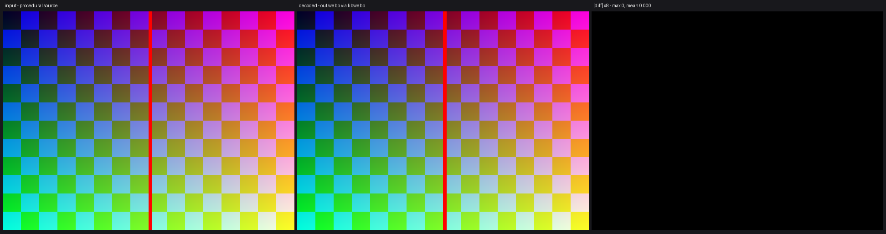

# p79_webp — How to encode lossless WebP in a Vulkan compute shader

VP8L lossless encoder in compute: flat 8-bit literal Huffman codes make every pixel exactly 24 bits at a fixed bit offset — no transforms, no LZ77, no histograms. CPU writes the ~137-byte bitstream header and the RIFF container; the GPU emits all pixel data in one dispatch.

**Tutorial post:** [How to encode lossless WebP in a Vulkan compute shader — flat literal Huffman codes](https://techoverflow.net/2026/10/02/how-to-encode-lossless-webp-in-a-vulkan-compute-shader-flat-literal-huffman-codes/)
on [TechOverflow](https://techoverflow.net).

## Build & run

```bash
g++ -std=c++23 -O2 main.cpp -o app -lvulkan -lshaderc
./check.py   # builds and verifies the output via PIL/libwebp
```

See the [repository README](../README.md) for dependencies and the
shared `vkmini.hpp` helper.

## Visual comparison



`./compare.py` rebuilds if needed, decodes the output via PIL and writes
`compare.png`: source | decoded | |diff| x8.
